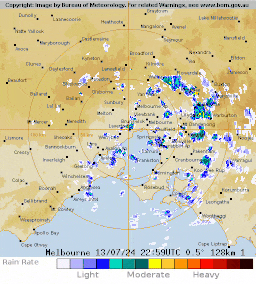
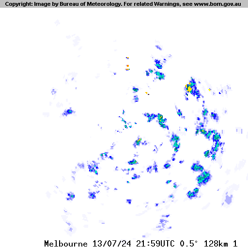

# Really Awesome Display of Meteorologic / Atmospheric Things (RADMAT)

RADMAT is designed to fetch the latest rain radar images from the Australian Bureau of Meteorology (BoM) for display on an [LED Matrix](/aliask/ledmatrix).

## Overview

The Bureau of Meteorology provides rain radar information which is popular in Melbourne (and possibly other cities). A phrase like "it's not raining unless the BoM shows it" is not unheard of.

The BoM website displays this data like this:

It's a cold day in the middle of winter today, and you can see the small clouds heading Northwards and bringing cold air up from Antarctica. Better grab that jacket.

This project aims to replicate this useful information away from a PC. Plus it just looks nice.

## Details

### 1. Download Raw Data

Downloads the latest images from the BoM FTP server (ftp.bom.gov.au). They look like this:

### 2. Prepare Fames

These images are then cropped and resized to fit the size of the LED Matrix (16x32 pixels)

### 3. Send Data

The resized frames are sent to the `ledserver` utility in the custom ledmatrix data format.
